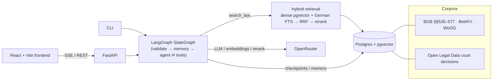

# mietrecht-rag — a grounded legal assistant for German rental law

An agentic **retrieval-augmented generation** system that answers German rental-law
(*Mietrecht*) questions **only** from real statutes and court decisions, cites every claim,
and never acts on a case without human approval. Built as a hand-written **LangGraph**
agent over **hybrid** (pgvector + Postgres German full-text) retrieval, with a FastAPI
backend, a React frontend, a RAGAs evaluation harness, and a fully dockerised stack.

> **Why it exists.** The rules that decide everyday tenancy disputes — how high a deposit
> may be, whether a termination is valid, which operating costs are billable — are
> scattered across the BGB (§§ 535–577), the Operating Costs Ordinance (BetrKV) and the
> Housing Allowance Act (WoGG), and their real meaning turns on case law that non-lawyers
> can rarely find. A plain chatbot will confidently invent legal "facts." This system gives
> precise, **verifiable** answers grounded in the actual law *and* the rulings.

---

## What makes it interesting (engineering highlights)

- **Hand-built LangGraph `StateGraph`, not a prebuilt agent factory** — explicit nodes and
  edges (`validate_input → load_memory → agent ⇄ tools → write_memory`), compiled with a
  Postgres checkpointer (short-term, per thread) and store (long-term, per user). One
  `run/stream/resume` entrypoint is shared identically by the CLI and the API.
- **Hybrid retrieval over two corpora in one call** — a single `search_law` tool fuses a
  dense `PGVectorStore` retriever with a Postgres FTS retriever
  (`websearch_to_tsquery('german', …)`) via reciprocal-rank fusion, then reranks. Legal
  text is keyword-driven, so lexical + dense together beat either alone.
- **Parent-document (small-to-big) retrieval for case law** — small child chunks are
  embedded for precision; the larger parent section is returned for context, with a
  parent-level rerank so the most on-point ruling lands first. This lifted case-law
  retrieval recall from **0.57 → 0.83** on the eval set (see [Evaluation](#evaluation)).
- **Honest, judge-free evaluation metrics** — alongside RAGAs (faithfulness / relevancy /
  context precision·recall), the eval reports **deterministic hit-rate@k and MRR** against
  each question's gold decision — a reproducible retrieval signal that doesn't depend on an
  LLM judge (whose context-precision score structurally understates for multi-decision
  parent retrieval).
- **Grounding discipline & a planted hallucination** — the agent may answer *only* from
  retrieved evidence and says so when the sources don't cover a question; the eval set
  includes a **planted hallucination** so the `faithfulness` metric actively guards against
  plausible-but-ungrounded answers.
- **Human-in-the-loop writes** — the two case-writing tools (`create_deadline`,
  `save_draft`) call LangGraph `interrupt()` first; nothing is persisted until the user
  approves in the UI.
- **Untrusted-input discipline (OWASP LLM05)** — every retrieved snippet and uploaded
  document is sanitised and wrapped in `<untrusted_context>` — data, never instructions.
- **Token-usage & cost tracking** — a shared usage callback aggregates per-model tokens
  across the agent, its tools and the RAGAs judge; the UI shows live token cost, and the
  eval run reports its own spend.
- **Server-side identity** — every API route derives the user from a JWT; memory, cases and
  feedback are namespaced by the authenticated user and case access is ownership-checked.

## Architecture



## Evaluation

RAGAs metrics per corpus plus deterministic retrieval metrics, scored against configured
thresholds (`uv run python main.py eval`, or the admin **Evaluation** view). Representative
run:

| Section | Metric | Score | Threshold |
|---|---|---|---|
| Agent (end-to-end) | faithfulness / answer-relevancy / context-precision / context-recall | 0.95 / 0.82 / 0.93 / 0.87 | 0.85 / 0.75 / 0.90 / 0.75 |
| Retrieval — statutes | context-precision / context-recall | 0.95 / 0.97 | 0.90 / 0.75 |
| Retrieval — case law | context-precision / context-recall | 0.78 / 0.76 | 0.90 / 0.75 |
| Retrieval — case law | **hit-rate@k / MRR** (deterministic) | **0.80 / 0.62** | 0.75 / 0.60 |

Case-law `context-precision` sits below target by design of the metric, not the retrieval:
parent-document retrieval returns several *valid* decisions per question, which the judge
scores against a single reference answer — the deterministic hit-rate/MRR are the more
faithful retrieval gauge here, and they pass.

## Feature overview

- **Free chat** — streaming, grounded agent turns with a **groundedness badge** and
  **clickable citations** that open the full statute/decision text in-app; three
  calculators, per-user long-term memory, a role persona (mieter/vermieter/jurist), saved
  history, and a **DE/EN** toggle for both UI and answers.
- **Cases ("Akten")** — each case has its own persistent chat thread, documents and
  deadlines:
  - **Ingest** letters/contracts (PDF/DOCX/TXT/images with OCR fallback); text is sanitised
    and stored; *Analysieren* streams a summary, the legal position with citations, and
    inferred **Fristen** (deadlines).
  - **Per-clause contract review** — each clause gets a verdict
    (wirksam/bedenklich/unwirksam) with its sources.
  - **Approval-gated actions** — the agent *proposes* deadlines and draft letters; the user
    confirms before anything is written. Approved drafts export to PDF.
- **Auth & roles** — Postgres accounts (bcrypt + JWT); an admin seeds users and sees the
  Evaluation view. No self-registration.

## Tech stack

Python 3.11 · LangGraph · LangChain · FastAPI · Postgres 16 + pgvector · RAGAs ·
React + Vite + TypeScript + Tailwind · OpenRouter (LLMs, embeddings, rerank) · Docker
Compose. Dependency management with `uv`; lint/type/test via ruff · mypy · pytest.

## Quick start (Docker)

```bash
cp .env.example .env
# fill in: OPENAI_API_KEY (OpenRouter), AUTH_SECRET (openssl rand -hex 32),
#          ADMIN_PASSWORD (min. 8 chars — seeds the admin account)

docker compose up --build -d
```

- Frontend: <http://localhost:8080> — log in as `admin` with your `ADMIN_PASSWORD`, then
  create user accounts in the **Benutzer** view.
- The backend runs `setup-db` on start (idempotent; also seeds the admin).
- **The corpora are not committed** (see below) — ingest them once inside the container:

```bash
docker compose exec backend uv run python main.py ingest-statutes
docker compose exec backend uv run python main.py ingest-case-law --dump-path PATH
```

## Local development

```bash
uv sync --dev
cp .env.example .env
docker compose up -d db
uv run python main.py setup-db

uv run python main.py serve --reload            # API  → http://localhost:8000
cd frontend && npm install && npm run dev       # UI   → http://localhost:5173 (proxies /api)
```

CLI (talks to the graph directly, bypassing API auth by design):

```bash
uv run python main.py ask -q "Wie hoch darf meine Kaution sein?" --user demo --role mieter
uv run python main.py eval
```

### Corpora (not committed)

The `data/` folder (statute JSON + the case-law dump) is git-ignored to keep the repo lean.
Regenerate the statute corpus from the Open Legal Data API:

```bash
uv run python fetch_legal_data.py       # → data/laws/rag_documents.json
```

The case-law corpus is a local Open Legal Data parquet dump; point `--dump-path` (or the
`CASE_LAW_DUMP_PATH` env var) at it. Every embedded chunk records its embedding model, and
queries refuse on a model mismatch.

## Development gate

```bash
uv run ruff check .    # lint
uv run mypy src        # type-check
uv run pytest          # full suite, offline (no Postgres/API keys required)
```

Tests run against pure functions and `InMemoryStore`/`InMemorySaver` fakes with a
monkeypatched graph — no live Postgres or model calls.

## Security & ethics (selected)

- **Not legal advice** — the assistant explains the law and links every source so users can
  verify; action questions append a disclaimer to consult a lawyer.
- **Grounding over fluency** — answers come only from retrieved evidence; the agent refuses
  when the corpora don't cover a question.
- **Data privacy** — server-side identity, per-user namespacing, ownership-checked case
  access, sanitised + capped document storage, cascading deletes.
- **Coverage limits** — the corpora are a filtered sample; the system is specific to German
  rental law and reflects the language, jurisdiction and selection bias of those sources.
